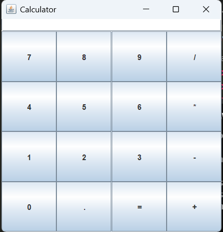

# GUI-Calculator

#GUI Calculator

###This is a Simple Calculator built using Java GUI. The project serves as a hands-on practice for Java programming and GUI design principles.

##Features
1.Perform basic arithmetic operations: Addition, Subtraction, Multiplication, and Division.
2.Interactive and user-friendly graphical interface.
3.Error handling for invalid inputs and division by zero.
4.Responsive layout for better usability.

